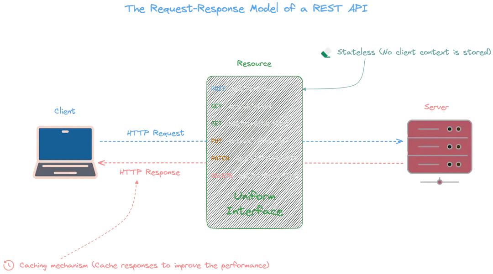
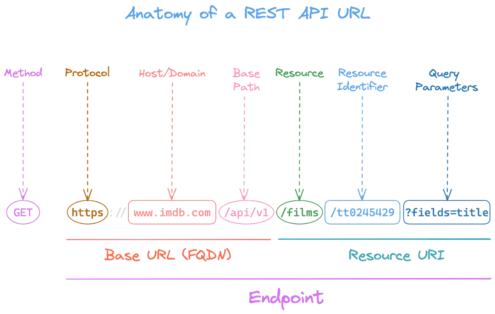
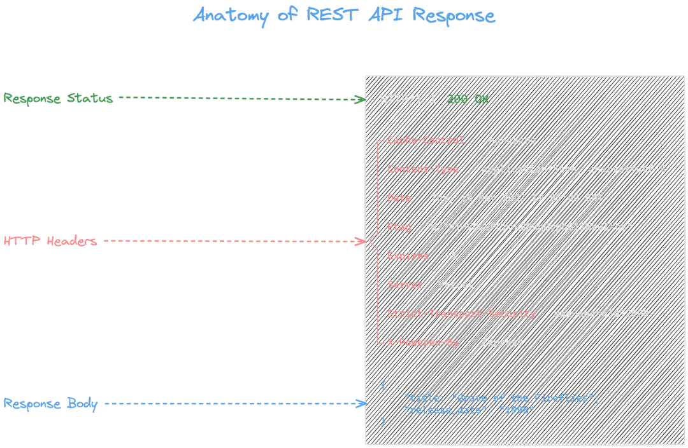
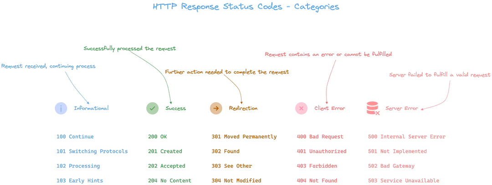
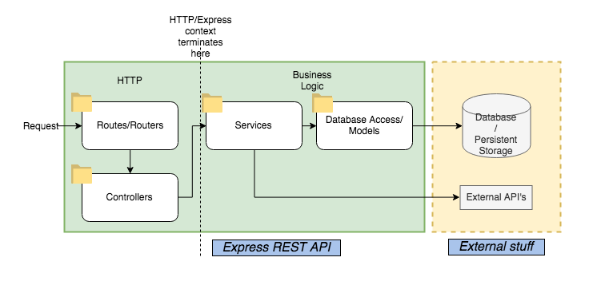
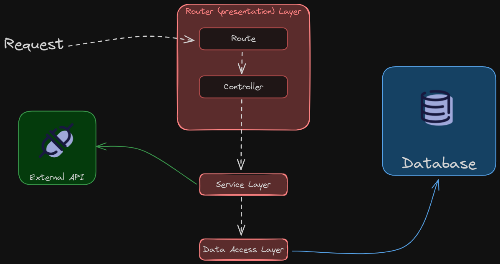

# A beginner guide to build a ReST API with node.js

[The article where the original code come from](https://blog.logrocket.com/build-rest-api-typescript-using-native-modules/)

Before continuing to refactor our code, let's take a look at the bigger picture.

## What happens when you hit the return button?


## Request-Response model for REsT



## Anatomy of a request URL



## Response anatomy



## Response status codes



## How to structure a ReST API



---



(layers vs tiers)

### [Three-tier application in web development](https://www.ibm.com/topics/three-tier-architecture)

In web development, the tiers have different names but perform similar functions:

- The web server is the presentation tier and provides the user interface. This is usually a web page or web site, such as an ecommerce site where the user adds products to the shopping cart, adds payment details or creates an account. The content can be static or dynamic, and is usually developed using HTML, CSS and Javascript.

- The application server corresponds to the middle tier, housing the business logic used to process user inputs. To continue the ecommerce example, this is the tier that queries the inventory database to return product availability, or adds details to a customer's profile. This layer often developed using Python, Ruby or PHP and runs a framework such as e Django, Rails, Symphony or ASP.NET, for example.

- The database server is the data or backend tier of a web application. It runs on database management software, such as MySQL, Oracle, DB2 or PostgreSQL, for example.

### Folder structure by technical role

```bash
|-- api/
|   |-- controllers/
|   |   |-- project-controller.ts
|   |   |-- task-controller.ts
|   |-- dao/
|   |   |-- project-dao.ts
|   |   |-- task-dao.ts
|   |-- models/
|   |   |-- project-model.ts
|   |   |-- task-model.ts
|   |-- routes/
|   |   |-- project-routes.ts
|   |   |-- task-routes.ts
|   |-- services/
|   |   |-- project-service.ts
|   |   |-- task-service.ts
|   |-- utils/
|   |   |-- index.ts
|-- app.ts
|-- index.ts
```

### Folder structure by business component

```bash
|-- api/
|   |-- components/
|   |   |-- project/
|   |   |   |-- controller.ts
|   |   |   |-- dao.ts
|   |   |   |-- model.ts
|   |   |   |-- routes.ts
|   |   |   |-- service.ts
|   |   |-- task/
|   |   |   |-- controller.ts
|   |   |   |-- dao.ts
|   |   |   |-- model.ts
|   |   |   |-- routes.ts
|   |   |   |-- service.ts
|-- app.ts
|-- index.ts
```

There is no one-size-fits-all solution; it depends on the specific requirements and context of the project. I'm going with the last option
